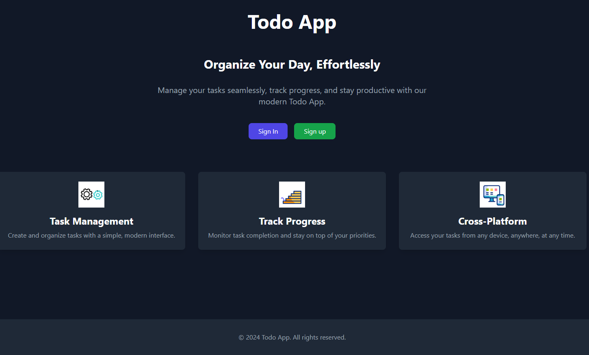
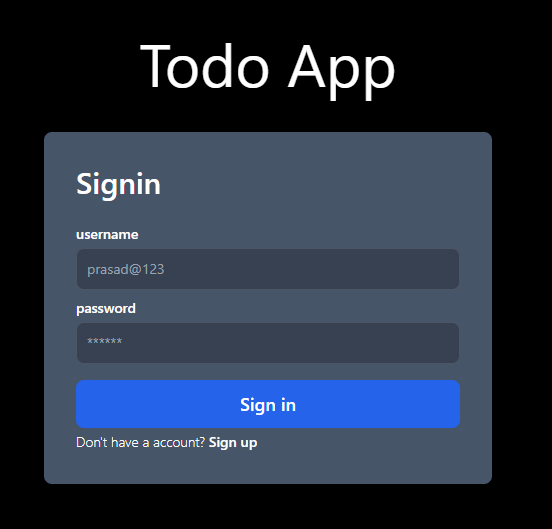
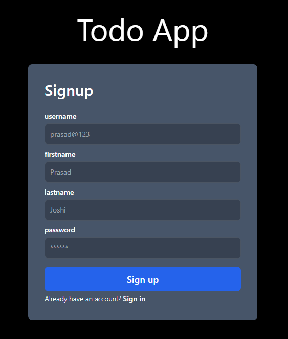
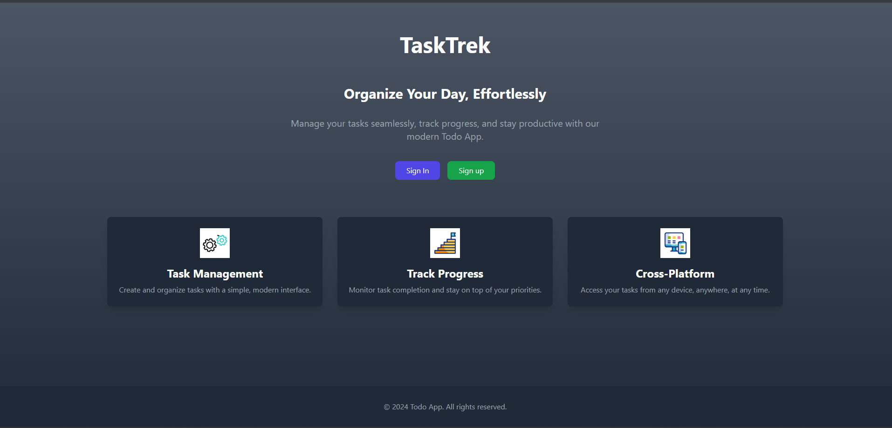
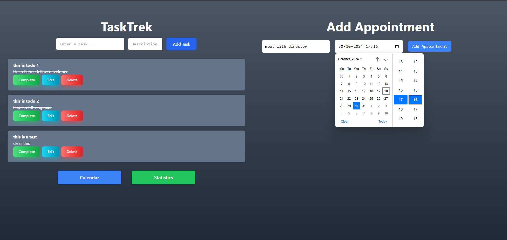
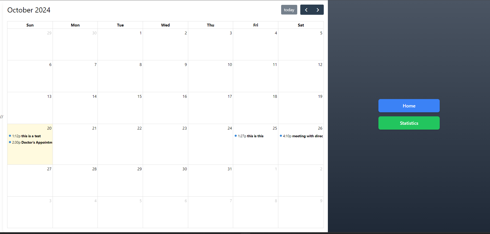
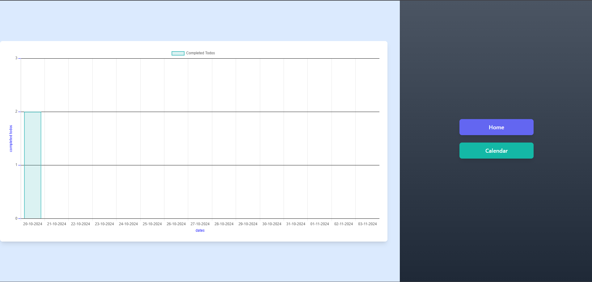

# Todo App



## Description

The **Todo App** helps users to organize their day effortlessly. Manage tasks, track progress, and stay productive with a modern interface and cross-platform support. This app allows you to:
- Create and organize tasks easily
- Monitor task progress and priorities
- Access your tasks from any device

## Features

- **Task Management**: Add, edit, and organize tasks
- **Progress Tracking**: Keep an eye on your progress and manage deadlines
- **Cross-Platform Support**: Works seamlessly across devices








## Project Structure

This project is built with **Vite** and **React**, ensuring fast and smooth development.


## Getting Started

Follow these steps to set up the project locally on your device.

### Prerequisites

Make sure you have the following installed:

- [Node.js](https://nodejs.org/) (version 14 or later)
- [npm](https://www.npmjs.com/) or [Yarn](https://yarnpkg.com/)

### Installation

1. **Clone the repository**:

    ```bash
    git clone https://github.com/your-username/todo-app.git
    ```

2. **Navigate to the project directory**:

    ```bash
    cd todo-app
    ```

3. **Install the dependencies**:

    Using npm:

    ```bash
    npm install
    ```

    Or using Yarn:

    ```bash
    yarn add
    ```

### Running the App

To start the development server, run:

```bash
npm run dev
```

### Building for Production

```bash
npm run build
```

### Preview Production Build

```bash
npm run preview
```


